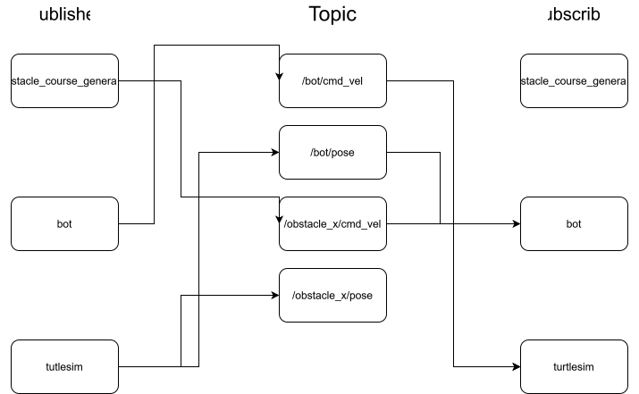

1. Jag valde göra en hinderbana eftersom jag tyckte att det verkade som ett roligt och rimligt alternativ som det fanns stor utvecklingspotential. Mitt paket skapar 5 stycken sköldpaddor på en slumpässig position inom (1,1) och (10,10). Min robot kan inte komma närmare än 1,5 enheter ifrån en av dessa sköldpaddor (hinder). Den får till en början en slumpmässig start och slutposition som den försöker ta sig till. Om den kommer nära ett hinder så hamnar roboten i en bana runt hindret till att den kan komma förbi.

2. 

3. Först behöver man bygga som man gör med följande kommandon `colcon build --packages-select obstacle_course`. Därefter behöver man uppdatera med `source install/setup.bash`. Och för att sedan köra koden behöver man använda `ros2 run obstacle_course launch`

4. Det som var svårast var att få robotet att inte fastna för lätt för det var lite för få vilkor som sa åt den vad de ska göra. För att programmet skulle fungera på en riktig robot skulle det behövas en fler noder som skulle kunna omvandla sensorvärden till ett kordinatsystem eftersom min kod utgår från att man får ett kodrinatsystem givet. Det här paketet skulle kunna appliceras på en robotdamsugare eller en robotgräsklippare då den skulle kunna åka till ett rum för att städa utan att köra över hinder. Turtlesim är en väldigt stor föreknling av verkligheten där man får alla värden exakt och i ett fast kordinatsytem medan verkligheten inte har ett sådant där man måste skapa
